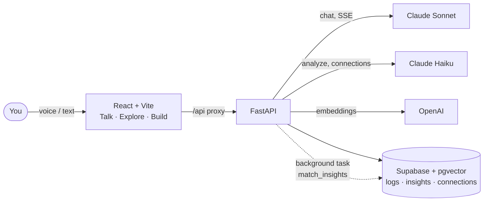

<div align="center">

<!-- TODO: create docs/banner-dark.png and docs/banner-light.png (1280x640) with the noeosorio.com palette (background #18181b, accent #bef264 → #10b981) and uncomment
<picture>
  <source media="(prefers-color-scheme: dark)" srcset="docs/banner-dark.png">
  
</picture>
-->

# KOS: Knowledge Operating System

**A Socratic second brain: talk about what you learn, and KOS turns it into a connected graph of your own insights.**


[Quickstart](#-quickstart) · [Architecture](#%EF%B8%8F-architecture) · [Report a bug](https://github.com/NoeOsorio/kos/issues)

</div>

You learn by talking, not by reading in silence. Instead of dumping notes into an app, you tell KOS what you read or experienced, and it answers with questions so *you* put the idea into words. The insights you approve get embedded and linked to what you already know, building a graph of your mind over time.

> *"You read chapter 3 of Thinking, Fast and Slow. How does that connect to what you learned about team decisions last week?"*

## ✨ Features

| | Feature | What it does |
|---|---|---|
| 🗣️ | **Talk** | Streaming Socratic chat (Claude Sonnet) that asks instead of lecturing, with voice input through the browser's Web Speech API and live audio visualizers |
| 🃏 | **Knowledge cards** | After each exchange, Claude Haiku extracts up to two personal topics with a short synthesis; nothing is saved until you approve it |
| 🔗 | **Auto-connections** | Saved insights are embedded (OpenAI `text-embedding-3-small`, 1536 dims) and a background task links them to similar insights via pgvector |
| 🌌 | **Explore** | Interactive knowledge graph of your insights and their connections, grouped into clusters |
| 🛠️ | **Build** | Workspaces to turn knowledge into a video script, self-exam, Q&A, summary or social thread (drafts are mocked for now; sessions persist in `localStorage`) |

## 🖼️ Demo

<!-- TODO: add docs/demo.gif (Talk → approve a card → see it in Explore) -->
Demo coming soon.

## 🚀 Quickstart

**Requirements:** Docker with Compose, or Node.js 20+ and Python 3.12+ for local development. You also need a Supabase project and API keys for Anthropic and OpenAI.

> [!WARNING]
> KOS calls paid APIs (Anthropic for chat and extraction, OpenAI for embeddings). Every message and every saved insight consumes credits.

### 1. Prepare the database

In your Supabase project's SQL editor:

1. Run [`backend/supabase/migrations/001_initial_schema.sql`](backend/supabase/migrations/001_initial_schema.sql) (enables `vector` and creates `logs`, `insights`, `connections`).
2. Create the `match_insights` function from [`.claude/specs/database.md`](.claude/specs/database.md#match_insights). The auto-connections task depends on it.

### 2. Run with Docker

```bash
git clone https://github.com/NoeOsorio/kos.git
cd kos
cp .env.example .env   # fill in your keys
docker compose up --build
```

| Service | URL |
|---|---|
| Frontend | http://localhost:5173 |
| Backend API | http://localhost:8000 |
| API docs (Swagger) | http://localhost:8000/docs |

<details>
<summary><b>Local development without Docker</b></summary>

**Backend**

```bash
cd backend
python -m venv .venv && source .venv/bin/activate
pip install -r requirements.txt -r requirements-dev.txt
cp .env.example .env   # fill in your keys
uvicorn app.main:app --reload
```

**Frontend** (Vite proxies `/api` to `http://localhost:8000`)

```bash
cd frontend
npm install
npm run dev
```

**Tests and checks**

```bash
cd backend && pytest
cd frontend && npm run test:run && npm run type-check && npm run lint
```

</details>

## ⚙️ Configuration

Copy [`.env.example`](.env.example) to `.env` (root, used by Docker Compose) or [`backend/.env.example`](backend/.env.example) to `backend/.env` (local backend). Settings are loaded in [`backend/app/core/config.py`](backend/app/core/config.py).

| Variable | Required | Purpose |
|---|---|---|
| `ANTHROPIC_API_KEY` | Yes | Claude Sonnet (Socratic chat) and Claude Haiku (topic extraction, connection labeling) |
| `OPENAI_API_KEY` | Yes | Embeddings with `text-embedding-3-small` |
| `SUPABASE_URL` | Yes | Your Supabase project URL |
| `SUPABASE_SERVICE_ROLE_KEY` | Yes | Server-side Supabase access (backend only, never expose it to the browser) |
| `PERPLEXITY_API_KEY` | No | Reserved for the upcoming script generator's web research; not used yet |
| `ENVIRONMENT` | No | `development` by default |
| `SECRET_KEY` | No | App secret; change it outside local development |

The frontend container also receives `VITE_API_URL` from `docker-compose.yml` so the Vite proxy can reach the backend service.

> [!TIP]
> The Supabase MCP server in [`.mcp.json`](.mcp.json) reads your project ref from the `SUPABASE_PROJECT_REF` environment variable. Export it in your shell before opening Claude Code.

## 🏗️ Architecture



| Endpoint | Purpose |
|---|---|
| `POST /api/chat` | Streaming Socratic conversation (Server-Sent Events) |
| `POST /api/analyze` | Extract knowledge topics from the latest exchange |
| `POST /api/insights/topic` | Save an approved card: creates a log and an embedded insight, then finds connections |
| `GET, POST /api/insights` · `GET, POST /api/logs` | List and create insights and activity logs |
| `GET /api/graph` | Nodes and edges for the Explore view |
| `GET /health` | Health check |

<details>
<summary><b>Planned agent design</b></summary>

1. **Socratic agent**: orchestrates the conversation and detects intent.
2. **Connections agent**: finds relationships between concepts in the background.
3. **RAG agent**: semantic search over your knowledge base.
4. **Researcher agent**: web research through Perplexity for scripts.
5. **Writer agent**: combines RAG and research into content in your voice.

</details>

## 📁 Structure

<details>
<summary>View structure</summary>

```text
kos/
├── backend/
│   ├── app/
│   │   ├── api/routes/      # chat, talk, analyze, insights, logs, graph
│   │   ├── core/            # settings and Supabase client
│   │   ├── services/        # embeddings and auto-connections
│   │   └── main.py          # FastAPI entry point
│   ├── supabase/migrations/ # initial schema
│   └── tests/               # pytest
├── frontend/
│   └── src/
│       ├── pages/           # Talk, Explore, Build, BuildWorkspace
│       ├── components/      # talk/, explore/, build/
│       ├── hooks/           # voice, speech, graph, knowledge cards
│       └── __tests__/       # Vitest + Testing Library
├── docs/superpowers/        # design specs and implementation plans
└── docker-compose.yml
```

</details>

## 🗺️ Roadmap

- [x] Monorepo scaffold with Docker Compose
- [x] Socratic chat with voice input and activity logs
- [x] Knowledge cards with explicit approval, embeddings and auto-connections
- [x] Interactive knowledge graph (Explore)
- [ ] RAG pipeline: chat with your brain, with source citations
- [ ] Script generator (your knowledge + Perplexity research), replacing the mocked Build drafts
- [ ] Spaced-repetition exams and a learning timeline PWA

## 📄 License

Distributed under the MIT License. See [`LICENSE`](LICENSE).

---

<div align="center">

Made with ☕ by [Noé Osorio](https://noeosorio.com) · [business@noeosorio.com](mailto:business@noeosorio.com)

</div>
